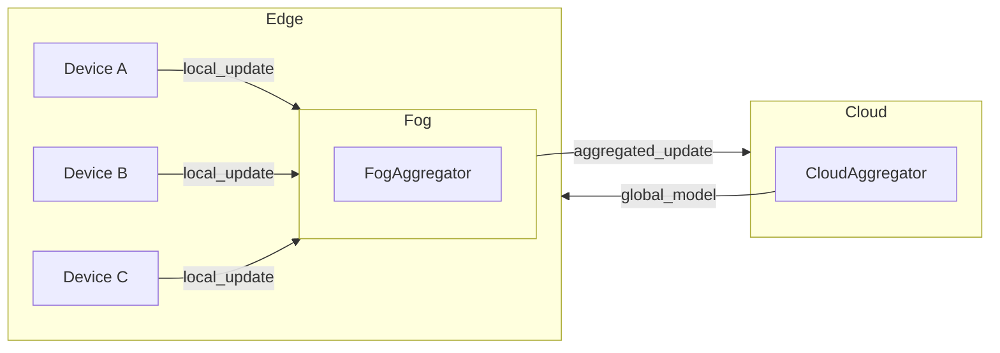

# DLA-AI Framework Design

This document outlines the architectural design, module interactions, and data flow for the Dynamic Layer‑Adaptive AI (DLA‑AI) Federated Learning framework.

### 7.1 Architecture Overview
The framework adopts a **top-down**, hierarchical **cloud–fog–edge** model:

- **Edge Layer**: Executes local training tasks on centrally pre‑partitioned datasets during idle device cycles.
- **Fog Layer**: Aggregates intermediate updates regionally, manages dynamic task reallocation, and handles fault tolerance.
- **Cloud Layer**: Performs final aggregation, advanced processing (e.g., fine‑tuning, transfer learning), and stores global model history.

