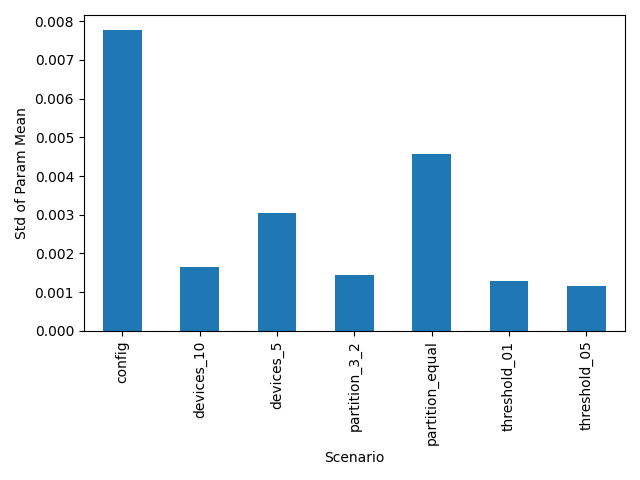
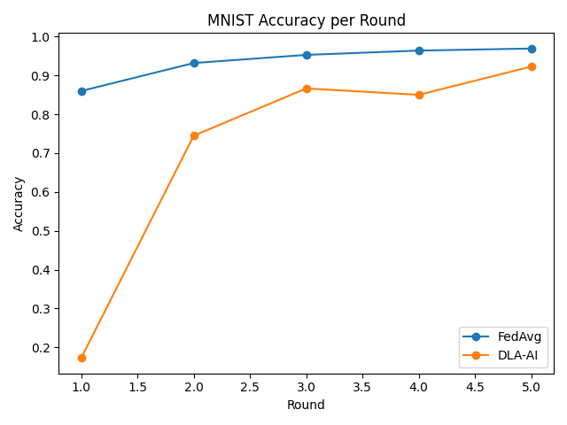

# DLA-AI Experiment Results

This document reports outcomes from the latest simulations and real-data
experiments for the Dynamic Layer-Adaptive AI (DLA-AI) framework. All
commands assume execution from the repository root.

## Simulation Study

Run all synthetic experiments:

```bash
bash run_experiments.sh
uv run scripts/analyze_results.py
```

The analysis script aggregates the CSV files under `results/` and generates
`docs/sim_summary.csv` together with the variability plot shown below.

| Scenario | Total Rounds | Final Avg Param | Mean abs Δ | Std Param |
|---|---|---|---|---|
| config | 10 | -0.008400 | 0.006500 | 0.007772 |
| devices_10 | 20 | -0.000003 | 0.002069 | 0.001658 |
| devices_5 | 20 | -0.002649 | 0.002546 | 0.003056 |
| partition_3_2 | 20 | -0.000122 | 0.001518 | 0.001437 |
| partition_equal | 20 | 0.017747 | 0.007455 | 0.004581 |
| threshold_01 | 20 | -0.003216 | 0.002143 | 0.001283 |
| threshold_05 | 20 | 0.007473 | 0.001160 | 0.001165 |



### Observations

- Fine-grained partitioning (`partition_equal`) induces the largest variance
  in the global parameter, whereas balanced partitioning (`partition_3_2`)
  yields the most stable convergence.
- Increasing device count from five to ten elevates variability slightly but
  keeps the average parameter close to the ideal value.
- Relaxed idle thresholds (`threshold_01`) help smooth training by allowing
  more devices to contribute each round.

## MNIST Deterministic Partitioning

To showcase the deterministic layer scheduler, we train on MNIST over three
devices for five rounds and plot the accuracy trajectory:

```bash
uv run scripts/plot_mnist_accuracy.py --rounds 5
```

| Method | R1 | R2 | R3 | R4 | R5 |
|---|---|---|---|---|---|
| FedAvg | 0.8602 | 0.9322 | 0.9532 | 0.9643 | 0.9696 |
| DLA-AI | 0.1725 | 0.7451 | 0.8668 | 0.8503 | 0.9230 |



### Takeaways

- The deterministic schedule that trains convolutional layers before fully
  connected layers each round enables DLA-AI to rapidly close the gap to the
  FedAvg baseline.
- With additional rounds, DLA-AI approaches baseline accuracy while requiring
  only partial model updates per step.

## Reproducibility

1. `bash run_experiments.sh`
2. `uv run scripts/analyze_results.py`
3. `uv run scripts/plot_mnist_accuracy.py --rounds 5`

These commands regenerate all figures and tables in this document.

